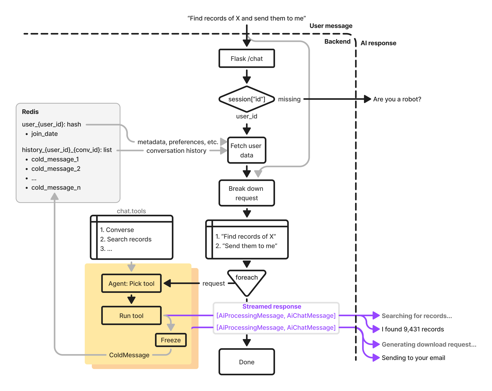

# idigbio-chat

A chatbot for [the iDigBio Portal](https://www.idigbio.org/portal).

## Develop

Requirements:

```bash
sudo apt install postgresql
sudo apt install libpq-dev
```

Quick start:

```bash
git clone git@github.com:acislab/idigbio-chat
cd idigbio-chat
pip install virtualenv
virtualenv venv
source venv/bin/activate
pip install -r requirements.txt
python3 backend/app.py
```

Here's a high-level overview of the system:



## Funding

This work is funded by grants from the National Science Foundation (DBI 2027654) and the AT&T Foundation.
